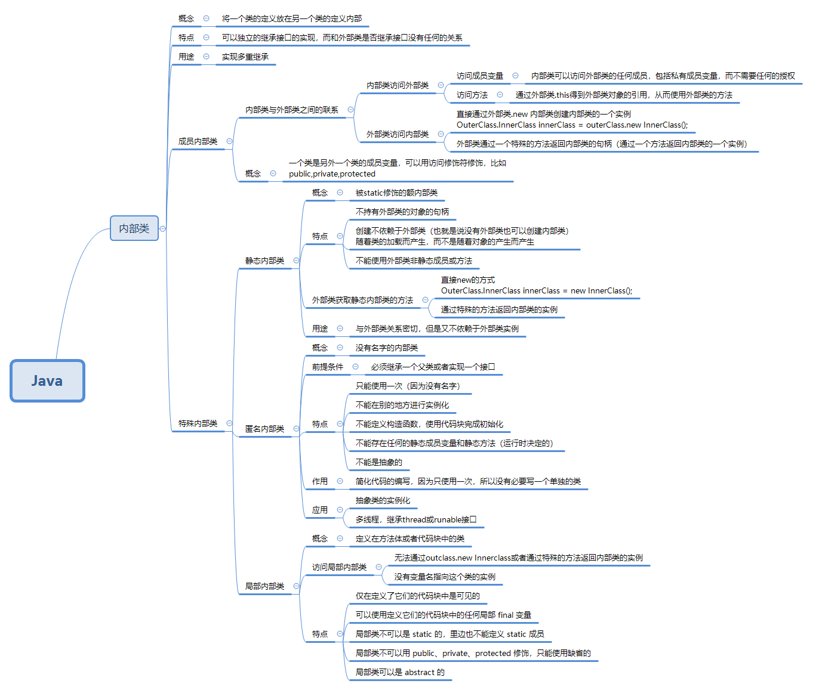

[TOC]

## 内部类


## 内部类的概念

将一个类的定义放在另一个类的定义内部

## 普通内部类

在外部类的方法ship()中使用内部类的实例对象,直接new

```java
package InnerClass;

public class Parcel {

    //内部类Contents
    class  Contents{
        //内部类的私有成员变量
        private int i = 11;

        public int getI() {
            return i;
        }
    }

    //内部类Destination
    class Destination{
        //内部类的私有成员变量
        private String destination;

        public Destination(String destination) {
            this.destination = destination;
        }

        public String getDestination(){
            return destination;
        }
    }

    //外部类Parcel的方法
    public void ship(String destination){
        //访问两个内部类创建两个实例
        Contents contents = new Contents();
        Destination destination1 = new Destination(destination);
        //通过两个实例分别访问内部类的私有变量
        System.out.println(destination1.getDestination());
        System.out.println(contents.getI());
    }

    public static void main(String[] args){

        Parcel parcel = new Parcel();
        parcel.ship("北京");

    }
}
//北京
//11
```

## 外部类如何访问内部类

- 直接通过外部类.new 内部类创建内部类的一个实例

```java
OuterClass.InnerClass innerClass = outerClass.new InnerClass();
```

- 外部类通过一个特殊的方法返回内部类的句柄（通过一个方法返回内部类的一个实例）

```java
      //返回内部类ontents的实例==>属于外部类pacel2
      //外部类持有一个内部类的句柄
        public Contents buildContents(){
            return new Contents();

        }
```

```java
//返回内部类Destination的实例==>属于外部类pacel2
//外部类持有一个内部类的句柄
public Destination travelTo(String destination){
    return new Destination(destination);
}
```

```java

        //外部类Parcel的方法
        public void ship(String destination){

            Contents contents = buildContents();
            Destination destination1 = travelTo(destination);

            //通过两个实例分别访问内部类的私有变量
            System.out.println(destination1.getDestination());
            System.out.println(contents.getI());
        }
```

```java
 public static void main(String[] args){

            Parcel2 parcel2 = new Parcel2();
            parcel2.ship("重庆");

            Parcel2 parcel21 = new Parcel2();
            Contents contents = parcel21.buildContents();
            Destination destination = parcel21.travelTo("上海");
            System.out.println(destination.getDestination());
            System.out.println(contents.getI());

        }

/*
重庆
11
上海
11
*/
```

## 内部类访问外部类

### 内部类访问外部类的成员变量

- 内部类可以访问外部类的任何成员，包括私有成员变量，而不需要任何的授权
- 同时内部类可以独立的继承接口的实现，而和外部类是否继承接口没有任何的关系

```java
package InnerClass;

public class Sequence {
    //外部类的私有成员变量
    private Object[] items;
    private int next = 0;

    public Sequence(int size) {
        items = new Object[size];
    }

    public void add(Object x){
        if(next < items.length){
            items[next++] = x;
        }
    }

    //内部类，实现selector接口
    //内部类可以秘密地获取到外部类的items对象的一个引用
    //内部类可以独立地继承一个接口的实现，无论外部类是否已经继承，都没有影响
    private class sequenceSelector implements  Selector{
        private int i = 0;

        @Override
        public boolean end() {
            //可以自由的访问外部类的私有成员变量items
            return i == items.length;
        }

        @Override
        public Object current() {
            return items[i];
        }

        @Override
        public void next() {

            if(i < items.length)
                i++;
        }
    }

    //封装类的作用就是利用一个特殊的方法创建这个内部类
    //返回一个继承了selector接口的私有内部类的句柄，实现对sequence的遍历操作
    public Selector createInnerClass(){
        return new sequenceSelector();
    }


    public static void main(String[] args){
        //再创建内部类之前需要对外部类（封装类）进行初始化
        Sequence sequence = new Sequence(10);
        for(int i = 0; i < 10; i++){
            sequence.add(Integer.toString(i));
        }
        //创建内部类（先有外部类才有内部类）
        Selector selector = sequence.createInnerClass();
        while (!selector.end()){
            System.out.println(selector.current() + " ");
            selector.next();
        }
    }

}

```

### 内部类获取外部类的方法

通过外部类.this得到外部类对象的引用，从而使用外部类的方法

比如我们想通过内部类sequenceSelector获得外部类sequence的一个实例对象，那么我们就可以在内部类sequenceSelector里面写如下的方法来获取到外部类对象的一个引用：OutClassName.this，从而可以调用外部类的任何一个方法。

```java

        public Sequence getOuterClass(){
            return Sequence.this;
        }
```

## 内部类的用途

### 实现多重继承

- 时候需要多重继承

  当一个类需要继承多个父类的时候，但是Java里面规定儿子只能有一个父亲，所以就可以通过在子类里面写内部类来分别继承多个父亲的基因（Java的特点：单继承多实现，只能extends一个父类，但是可以实现多个接口，但是如果这时父亲们都是类，不是接口，但又要继承他们的基因，就需要用到内部类）

比如我们现在有一个新的产品需要继承两种基本的产品的性能，将两种基本的产品结合起来，继承他们的优点，同时还能有自己的优点

如果我们采用同时继承两种基本产品的优点又不行


父类产品一BaseProductA

```java
package InnerClass;

public class BaseProductA {
    private int flexibility = 10;
    private int ductility;

    public int getFlexibility() {
        return flexibility;
    }

    public void setFlexibility(int flexibility) {
        this.flexibility = flexibility;
    }

    public int getDuctility() {
        return ductility;
    }

    public void setDuctility(int ductility) {
        this.ductility = ductility;
    }
}

```

父类产品二

```java
package InnerClass;

public class BaseProductB {
    private int thermostability = 20;
    private int stability;

    public int getThermostability() {
        return thermostability;
    }

    public void setThermostability(int thermostability) {
        this.thermostability = thermostability;
    }

    public int getStability() {
        return stability;
    }

    public void setStability(int stability) {
        this.stability = stability;
    }
}

```

子类产品NewProduct

```java
package InnerClass;

public class NewProduct {
    //通过一个特殊方法来获取内部类的实例对象
    public ExtendsProductB getInnerclassB(){
        return new ExtendsProductB();
    }

    //inner class1
    class ExtendProductA extends BaseProductA{
        @Override
        public int getFlexibility() {
            return super.getFlexibility() + 1;
        }
    }
    //inner class2
    class ExtendsProductB extends BaseProductB{
        @Override
        public int getThermostability() {
            return super.getThermostability() + 1;
        }
    }

    public static void main(String[] args){

        NewProduct newProduct = new NewProduct();
        //获取内部类实例的方法一 直接new
        NewProduct.ExtendProductA extendProductA = newProduct.new ExtendProductA();
        int flexibility = extendProductA.getFlexibility();
        //获取内部类的实例方法二 通过方法获取
        ExtendsProductB extendsProductB = newProduct.getInnerclassB();
        int thermostability = extendsProductB.getThermostability();
        System.out.println(flexibility);
        System.out.println(thermostability);

    }
}

```

## 特殊的内部类

### 静态内部类

#### 获取静态内部类的方法

- 通过new的方式：OuterClass.InnerClass innerClass = new InnerClass();（这里不用先获取到外部类的实例再new ,创建不依赖于外部类）
- 通过特殊的方法返回内部类的实例

#### 特点

- 不持有外部类的对象的句柄
- 创建不依赖于外部类（也就是说没有外部类也可以创建内部类）
- 不能使用外部类非静态成员或方法

```java
package InnerClass;

public class OuterClasss {
    //静态属性
    private static int id;
    //非静态属性
    private  String name;

    //静态方法
    public static int getId() {
        return id;
    }

    //非静态方法
    public void setId(int id) {
        this.id = id;
    }


    //静态内部类
    public static  class InnerClass{
        //调用外部类静态方法
        int OuterId = getId();

        /**
         * 不能获取非静态方法
         * setId();
         *
         */

        public int getOuterID(){
            //获取外部类的静态成员变量
            return id;
        }
        /*
        不能获取name属性
        public String getOuterName(){
            return name;
        }
        */
    }

    private class nonStaticClass{
        //可以获取非静态属性
        public String getOuterName(){
            return name;
        }
    }


    public static void main(String[] args){

       OuterClasss.InnerClass innerClass = new InnerClass();
        int outerID = innerClass.getOuterID();

        /**
         * 非静态内部类不能直接new
         *  OuterClasss.nonStaticClass nonStaticClass = new nonStaticClass();
         */
        OuterClasss outerClasss = new OuterClasss();
        OuterClasss.nonStaticClass nonStaticClass = outerClasss.new nonStaticClass();
        String outerName = nonStaticClass.getOuterName();
        


    }
}

```

### 局部内部类

#### 概念

定义在方法体或者代码块中的类

#### 实现

```java
package InnerClass;

public class LocalClass {
    public void fun(){
        //局部内部类
          class InnerClass{
            private  int id = 0;
            public int getId() {
                return id;
            }
        }
     
    }

}

```

#### 特点

1. 仅在定义了它们的代码块中是可见的；
2. 可以使用定义它们的代码块中的任何局部 final 变量；
3. 局部类不可以是 static 的，里边也不能定义 static 成员；
4. 局部类不可以用 public、private、protected 修饰，只能使用缺省的；
5. 局部类可以是 abstract 的。

### 匿名内部类

#### 概念

没有名字的内部类

#### 前提条件

必须继承一个父类或者实现一个接口

#### 特点

- 只能使用一次（因为没有名字）
- 不能在别的地方进行实例化
- 不能定义构造函数，使用代码块完成初始化
- 不能存在任何的静态成员变量和静态方法（运行时决定的）
- 不能是抽象的

#### 作用

简化代码的编写，因为只使用一次，所以没有必要写一个单独的类

#### 匿名内部类的起源

这里引用[Nerxious](https://www.cnblogs.com/nerxious/)的一篇博客里面的代码

```java
abstract class Person {
    public abstract void eat();
}
 
class Child extends Person {
    public void eat() {
        System.out.println("eat something");
    }
}
 
public class Demo {
    public static void main(String[] args) {
        //实例化Child实例，并向上转型为Person
        Person p = new Child();
        p.eat();
    }
}
```

这里的child类只有在创建实际类型的时候用到了，但是静态类型仍然属于person，所以如果我们只需要一个实际类型的时候而不需要静态类型，那么可以直接对静态类型进行实例化，并在实例化的过程中实现对应的抽象方法。

#### 应用

- ##### 抽象类的实例化

```java
package InnerClass;

public  class Anonymity {
    abstract class Person{
        abstract void eat();
    }

    public void test(){
        //所以如果要对抽象类实例化，那么只要实现里面的抽象方法就可以了
         Person person = new Person(){
            @Override
            void eat() {
                System.out.println("eat something");
            }
        };
        person.eat();
    }
    public static void main(String[] args){

        Anonymity anonymity = new Anonymity();
        anonymity.test();
    }
}

```

- ##### 多线程，继承thread或runable接口

这里同样参考了博主[Nerxious](https://www.cnblogs.com/nerxious/)的代码

```java
package InnerClass;

public class Test2 {
    public static void main(String[] args){

        Thread thread = new Thread() {
            @Override
            public void run() {
                for(int i = 0; i < 10; i++){

                    System.out.print(i + " ");
                }
            }
        };
        thread.start();
    }
}

```

```java
package InnerClass;

public class Test2 {
    public static void main(String[] args) {

        Runnable runnable = new Runnable() {

            @Override
            public void run() {
                for(int i = 0; i < 10; i++){
                    System.out.print(i + " ");
                }

            }
        };

        Thread thread = new Thread(runnable);
        thread.start();
    }
}

```


[[java提高篇(八)----详解内部类](https://www.cnblogs.com/chenssy/p/3388487.html)

[Java静态内部类、匿名内部类、成员式内部类和局部内部类](http://www.weixueyuan.net/view/6007.html)

[[java中的匿名内部类总结](https://www.cnblogs.com/nerxious/archive/2013/01/25/2876489.html)


